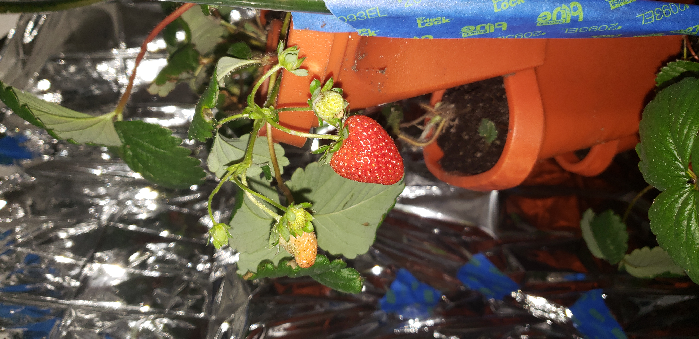

# The roots
## Starting off
It was 2019, the summer before high school. Many projects were coming to a close, and I was still unburdened by schoolwork. My vinal wall sticker endeavor had completed; my 3d-printed avocado production had died down. I was beginning to grow my interest in tech, and wanted to learn Arduino in a practical and applied way before high school. Given that my closet had just freed up from my Komboocha brewing apparatus, I knew it was ripe for project-iation. I wasn't ready to let it sit dormant, and had the idea of transforming the closet into a garden.

# Moldy Strawberries

## Setup
The first phase of the closet garden was, in fact, not actually hydroponics. My research began by looking for fast growing, easily maintainable plants, and settled on strawberries. I bought some seeds on ebay, and decided on a grow tower to maximize the area of my closet--if successful, there'd be room for many more towers. Meanwhile, I set up an Arduino system to automatically water when the soil got too dry, from a large bucket, a task that ended up being too capricious. Because of this, I pivoted to timer based watering. I also set up a light system, which was was equally challenging--the first light melted itself, the second one wasn't bright enough, but the third batch from Amazon did work well. 

## Success
On the brighter side, most of the strawberries did germinate, and the plants did begin to grow. There came a point where the plants were branching out, and really were booming. Eventually I did begin getting strawberries, but it wouldn't last. Eventually, I began noticing white powder under the leaves--the plants had begun to mold. I tried to fix this by adding a dehumidifier to lower the humidity, and bought Neem oil as a natural fungicide. This did not work, so I caved and bought synthetic fungicide. This did work, but rendered the plants inedible for a few months, which unfortunately was the end of the strawberry season.