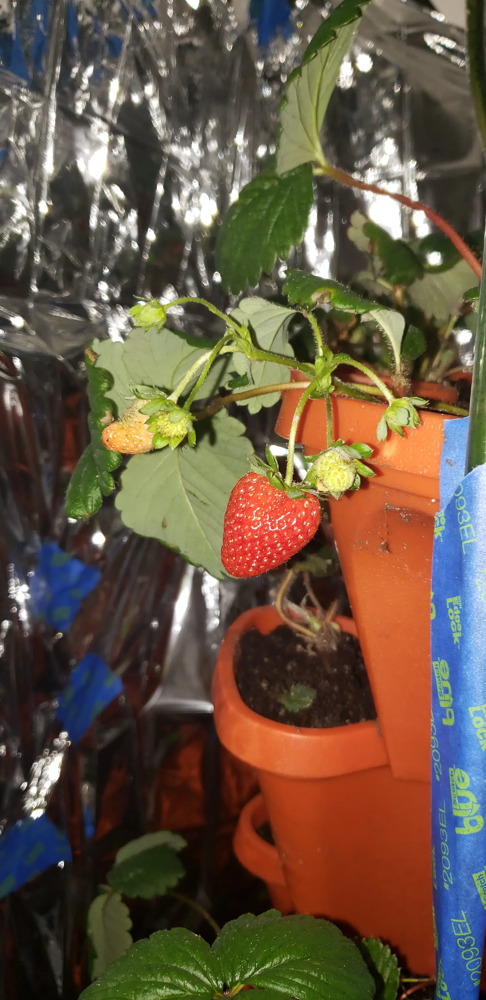

# The roots
## Starting off
It was 2019, the summer before high school. Many projects were coming to a close, and I was still unburdened by schoolwork. My vinyl wall Office-Quote sticker endeavor had completed; my 3d-printed avocado production had died down. My interest in tech was beginning, and I wanted to learn Arduino in a practical and applied way before high school. My closet had just freed up from my Kombucha brewing apparatus, and was ripe for project-iation. I wasn't ready to let it sit dormant, so I decided to transform the closet into an automated garden.

# Moldy Strawberries

## Setup
The first phase of the closet garden was, in fact, not actually hydroponics. My research began by looking for fast growing, easily maintainable plants, and settled on strawberries. I bought some seeds on ebay, and decided on a grow tower to maximize the area of my closet. If successful, there'd be room for many more towers, but I'd start with one. Meanwhile, I set up an Arduino system to automatically disperse water from a large bucket when the soil dried up, using a soil moisture sensor. It turned out to not water often enough, or over-water and leak, so I pivoted to timer based watering. For lighting, I settled on a sketchy, cheap Amazon grow light, which melted itself and set off my GFCI outlet. The replacement one was better, but still wasn't bright enough, and then the third batch worked well, though it heated up my closet to an ambient 85.  

## Success
Within a few weeks, most of the strawberries germinated, and the plants began thriving. They began branching out, and runners (baby plants attached to the mother plant) started shooting out. Within weeks, flowers appeared, and then the first few fruits. They were juicy, bright red, and perfect—until the mold started. I tried adding a dehumidifier, and bought Neem oil as a natural fungicide to protect the edibility of the fruit, but it was futile. After caving to synthetic fungicide, I rid the plants of fungus, and effectively made the plant ornamental for months to come. After eventually giving away the plants so that they could thrive outside, it was back to the drawing board.

# Hydroponics
